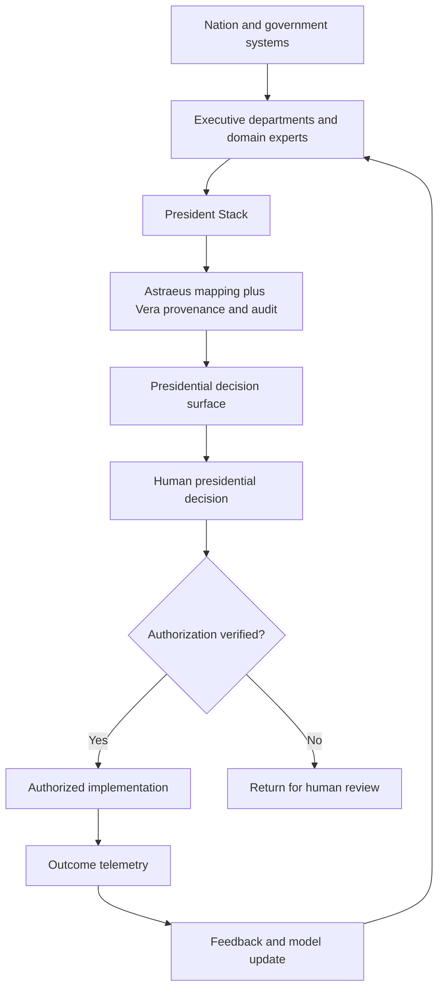

# Information flow

Epistemic status: **DESIGN HYPOTHESIS**. Bootstrap date: 2026-09-21.
Source: SRC-0001; generated design elaborations are proposals, not adopted decisions.

Conceptual design; arrows do not grant authority or imply deployment.

